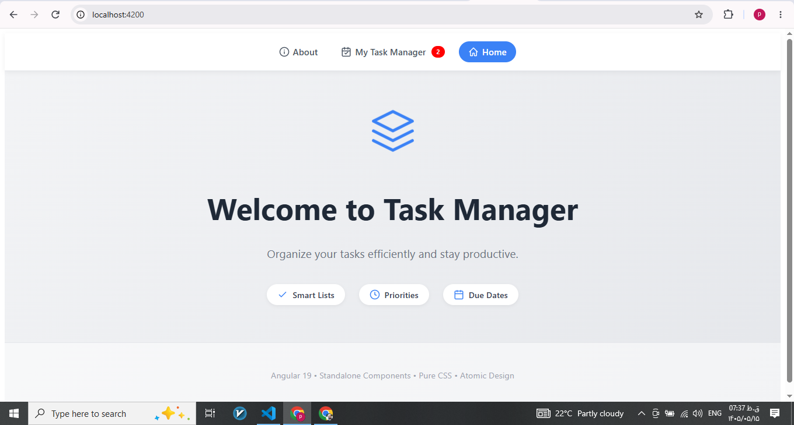
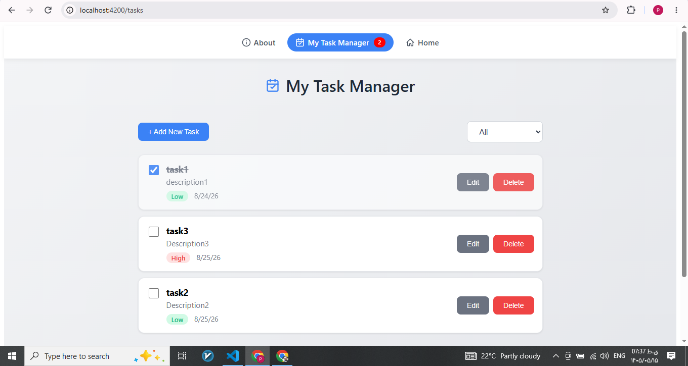
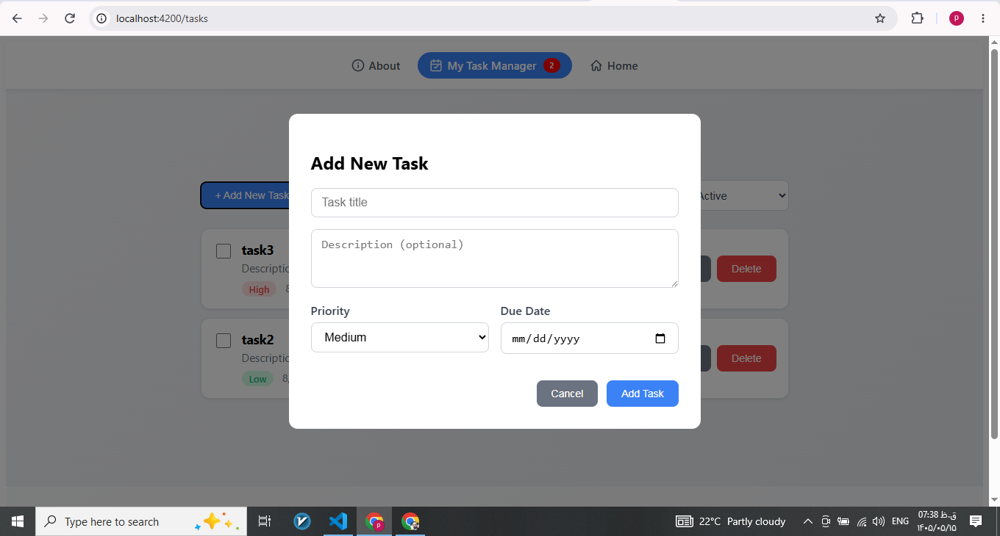

markdown
# ✅ Angular Standalone Task Manager

A modern task management application built with **Angular 19** using **Standalone Components** and **Atomic Design** pattern, featuring **NgRx** for state management demonstration.

## ✨ Features

- 📋 Add, edit, and delete tasks
- ✅ Mark tasks as complete / incomplete
- 🔍 Filter tasks by status (All, Active, Completed)
- 📱 Responsive design
- 💾 Data persisted in localStorage
- 🎨 Professional SVG icons
- 🧭 Multi-page routing (Home, About, Task Manager)
- 🎯 Reactive state management with BehaviorSubject & NgRx
- 🔢 Active task counter in navbar (powered by NgRx)

## 🛠️ Tech Stack

- Angular 19 (Standalone Components)
- TypeScript
- RxJS (BehaviorSubject)
- **NgRx** (for state management demonstration)
- HTML5 / CSS3 (Pure CSS)
- Atomic Design pattern
- UUID for unique IDs

## 🖼️ Screenshots

### Home Page


### My Task Manager


### Add New Task Modal


## 🚀 Quick Start

### Prerequisites

- Node.js (v18 or later)
- Angular CLI

### Installation

```bash
# Clone the repository
git clone https://github.com/your-username/angular-standalone-task-manager.git

# Navigate to project directory
cd angular-standalone-task-manager

# Install dependencies
npm install

# Run development server
ng serve
Navigate to http://localhost:4200/ to view the application.

🧠 Architecture & State Management
This project demonstrates two complementary approaches to state management:

1. Service + BehaviorSubject (Primary)
The main application logic uses a service-based architecture with RxJS BehaviorSubject for reactive state management. This approach is simple, lightweight, and perfectly suited for the application's current scope.

2. NgRx (Demonstration)
To showcase enterprise-grade state management capabilities, the project includes a minimal NgRx implementation for tracking the count of active (incomplete) tasks. This demonstrates:

Actions: incrementActiveTasks, decrementActiveTasks, setActiveTasksCount

Reducer: Manages the active count state

Selector: selectActiveTasksCount for reading data in components

Integration: NgRx store is registered in app.config.ts and used in the navbar component

This hybrid approach proves that the architecture can scale to meet enterprise requirements while maintaining simplicity where appropriate.

📁 Project Structure
text
src/app/
├── features/
│   └── task/
│       ├── task.model.ts          # Task interface
│       ├── task.service.ts        # State management with BehaviorSubject
│       └── store/                 # NgRx implementation
│           ├── task.actions.ts    # NgRx Actions
│           ├── task.reducer.ts    # NgRx Reducer
│           └── task.selectors.ts  # NgRx Selectors
├── pages/
│   ├── home/                      # Landing page
│   ├── about/                     # About page
│   └── task-manager/              # Main task management page
└── shared/
    ├── atoms/
    │   └── button/                # Reusable button component
    └── molecules/
        ├── task-item/             # Individual task display
        ├── task-edit/             # Add/Edit modal
        └── navbar/                # Navigation bar with active task counter
🎯 Key Features Explained
Task Management
Add Task: Click the "Add New Task" button to open a modal form

Edit Task: Click the edit icon on any task to modify details

Delete Task: Remove tasks with a confirmation dialog

Complete Task: Toggle task status with a checkbox

Filtering
Filter tasks by status using the dropdown selector

Default filter shows Active tasks (incomplete)

Routing
Home: Landing page with welcome message

About: Project information

Task Manager: Full task management interface

Active Task Counter (NgRx)
The navbar displays the number of active (incomplete) tasks

Updates automatically when tasks are added, completed, or deleted

Powered by NgRx for demonstration purposes

📦 Build
bash
# Production build
ng build --configuration production

# Development build
ng build
🧪 Testing
bash
# Unit tests
ng test

# End-to-end tests (coming soon)
ng e2e
📝 Commit History
This project follows a clean commit history with meaningful messages:

text
feat(ngrx): add NgRx for tracking active task count in navbar
feat(task-list): enhance task management with modal add, dropdown filter, and updated navbar layout
fix(navbar,about): wrap SVG icons in span containers for better alignment and consistency
feat(routing): add routing with Home and About pages
fix(state): replace window.reload with BehaviorSubject and switch UI to English
🤝 Contributing
Contributions are welcome! Please feel free to submit a Pull Request.

📄 License
This project is licensed under the MIT License.